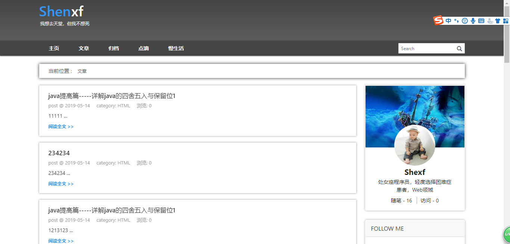
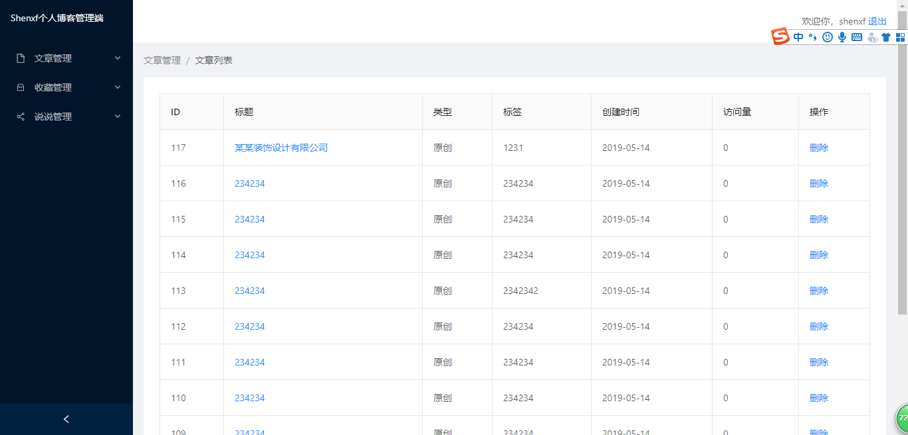

<!--
 * @Description: 说明文件
 * @Author: shenxf
 * @Date: 2019-02-27 12:16:55
 -->
# 小沈的个人网站

展示自己的个人博客网站

## 状态

- 大部分开发已经完成，现在正在测试。

## 画面展示

1. 前台画面 https://www.shenxf.com:3002

2. 后台画面 https://www.shenxf.com/vue2/  账号：admin 密码：123456
- 由于服务器带宽的原因，第一次加载会比较慢，请耐心等待。

### 使用

1. 前台画面
    - [前台博客画面](background/blog)

2. 后台后端
    - [后台后端](background/admin)

3. 后台前端
    - [后台前端](background/admin)

### 部署

- 使用docker进行部署
    + [docker部署](docker)

## 问题

### 博客前台画面
1. 当初为了SEO，大部分画面都是全页面渲染的，导致页面加载时间比较慢。
    - 其实需要SEO的只有文章详情页面其他页面应该用局部渲染。这是个失策。由于改动较大，不会去改正了。
    - 翻页用的是局部渲染。所以加载较快。
    - 现在启用了 koa 的 Gzip 功能，访问速度变快了。坏处是IE6和IE6以下的浏览器不支持。

2. 代码没有进行压缩
    - 如果是真实项目，肯定会进行压缩，但是我这个项目就不压缩了。

3. 是个死网站
    - 没有互动的博客网站是不完美的。
    - 所以应该要添加评论功能。而这个功能用第三方的最省事了。
    - 还有就是没有统计功能。这个功能也最好不要自己写。
    - leanCloud的提供了统计和评论以及评论提醒功能，用它又省事又安全。请参照我的博客网站整理的博客网站相关内容。
        + [前端网站整理](https://shenxf.top/2019/04/23/20190423-siteMemo/)

### 博客后台画面
1. 画面布局不太好，感觉增删改应该用模态框。

2. 后面有点偷懒了，home画面和文章列表一样。没有系统配置画面等。

## 感想

- 比想象中的开发速度要快，也学到了不少东西。
- 但是项目中还有很多不足的地方需要改善。