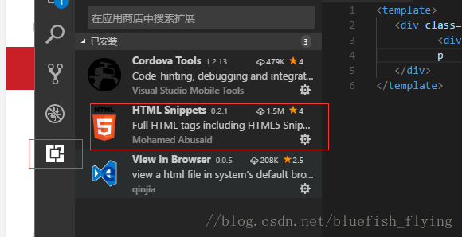
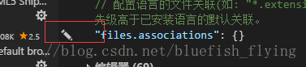
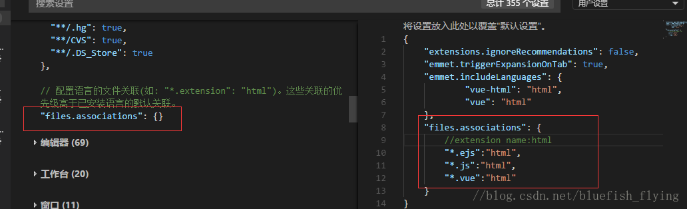
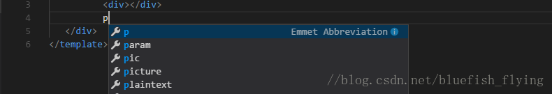
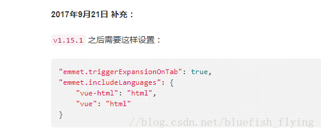

<!--
 * @Description: vue文件中使用html代码补全功能
 * @Author: shenxf
 * @Date: 2019-03-25 21:24:43
 -->
# 使用vscode时，如何在.vue文件中使用html代码补全功能

使用vscode编写vue代码，刚开始点击tab是不会自动补全代码的，这个就很郁闷了。
百度了半天：https://segmentfault.com/a/1190000010339485 参考这个最后解决了问题

## 一、HTML Snippets

- 在vscode中把这个插件下载了并且启用，然后翻阅插件的ReadMe，我们可以看到如下图得FAQ:

- 这段代码是提示我们需要在settings.json中配置files.associations的属性。

## 二、settings.json中配置files.associations对象

- 首先，依次打开“文件 --> 首选项 --> 设置”，就会看到settings.json文件了

- 然后在settings.json中找到“常用设置”里的files.associations对象

- 然后把鼠标滑到对象的左边，会出现如图所示的一个“编辑”的标志，点击它，就会打开右边编辑页，如图：

- 按照上图的步骤去配置就可以了，然后再回到.vue的页面，打出div，再按住tab键，就可以自动补全代码了，这里只用写最后一句话就可以了

- 可以看到也出现了代码提示功能，你可以选择一个自己想要的，也可以不选，直接按住tab键，就可以生成`

`了，如下图：

- 之后的设置

